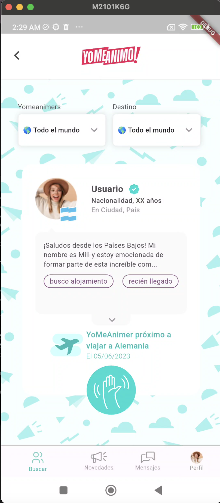
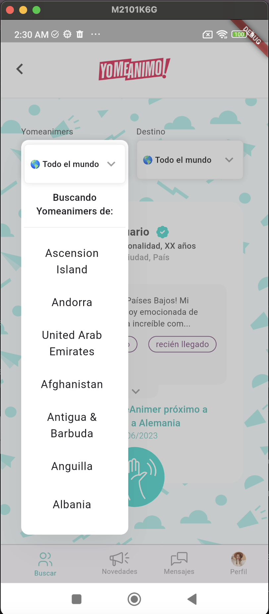
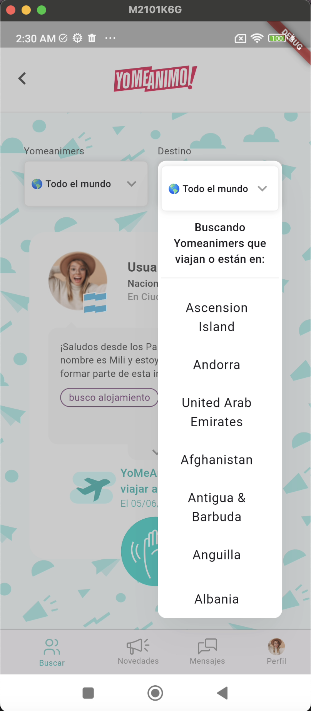
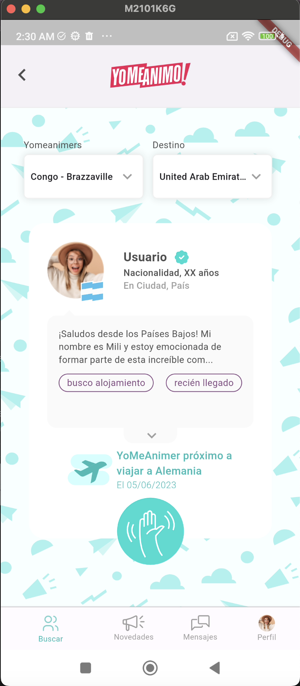

# YoMeAnimo - Prueba en Flutter

Este proyecto es una prueba de replicar una vista diseñada en Figma para la aplicación YoMeAnimo utilizando Dart.

## Descripción
El objetivo de esta prueba era recrear fielmente una vista diseñada en Figma en la aplicación YoMeAnimo. Además, se implementaron funcionalidades adicionales, como hacer que los dropdown para seleccionar el país fueran interactivos y se ajustaran al diseño propuesto.

## Capturas de Pantalla
A continuación se muestran algunas capturas de pantalla de la aplicación:

1. 
2. 
3. 
4. 

## Conclusiones
En conclusión, disfruté mucho trabajando en esta prueba y estoy satisfecho con el resultado alcanzado. Espero poder contribuir con mis conocimientos al desarrollo exitoso de la aplicación YoMeAnimo.
